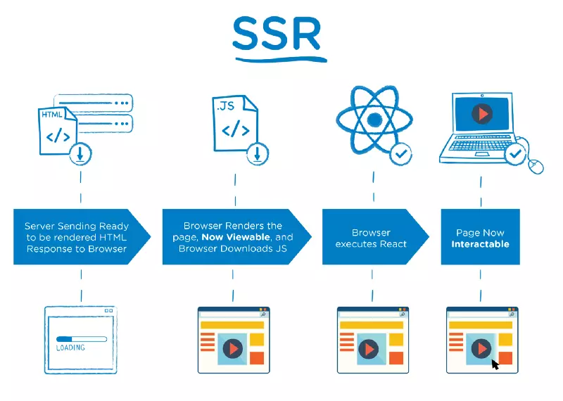

# FRONT-END JOURNEY

## Server Side Rendering (SSR) vs Client Side Rendering (CSR)

Web application growth within CSR.

SSR model :



How it works :

- Browser sends request to Server for rendering page.
- HTML rendered by Server and return response to browser. The page is now **viewable**. Browser then continues download the JS from server to manage the interactions.
- After downloading, it will execute React to make interactable webpage.
- The webpage completed rendering and return a full interactable webpage

Weakness :

- Browser makes request to re-render full page for every single changes.
- Process HTML on Server wastes resources.
- Request made to Server maybe a lot.
- High TTFB due to processing everything on Server.

Strenth:

- Supporting SEO.
- Fast loading first time.
- Great with static page.

CSR model :


How it works:

- Server sending raw data or computed data to browser.
- Browser excutes and render webpage.
- The page is now ready both **viewable and interactable** for the first time render.

Weakness:

-

## CORS error

- Sending request and response between domain causes CORS error
- CORS is like a "security door"

* Fix : BE must have

```javascript
app.use((req, res, next) => {
  res.setHeader("Access-Control-Allow-Origin", "*");
  res.setHeader("Access-Control-Allow-Headers", "Origin, X-Requested-With, Content-Type, Accept, Authorization");
  res.setHeader("Access-Control-Allow-Methods", "GET, POST, PATCH, DELETE");
});
```
