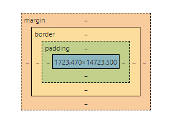

## Box model
Basic technique in CSS. Consider all CSS element as a box.
It's a set of rule that Browser uses to determind the size of the element.



- width, height
- Margin : add extra space outside the box. Not affect width, height of element.
- Outline and box shadow :
- Border : add border (line, dash) to edges of the box
- Padding : add extra space between content inside and the box.
- Content area : have a width and a height, hold the content of the element
- Box-sizing : handle problem changing width height won't change the the element size.
  + Content box : default value.
  + Border-box : auto width height of content. Not changing element size when padding and border is changed
- Intrinsic-sizing : Let the browser decide the the size for the element. When the **content** overflow out of the element, we can change element size to match the content.
  - min-content : element width will fit the longhest part in content.
  - max-content : element width will fit all the content width.
  - fit-content : a hybrid between the min-content and max-content. It will dynamicly change between min-content and max content if necessary.

- inline, block, inline-block:
  - Inline : inline dislay doesn't respect margin top, bottom and padding. All elements on the same line.
  - Block : respected all above rules. New elements appear on the next line.
  - Inline-block : A hybrid that being rendered as an inline but having the behavior of a block.

Using devtools to debug box model

## Seclector
Simple selector :

- Type selector ( element )
```css
div {
    color: white;
}
```
- Class selector ( ```class='myClass'``` )
```css
.my-class{
    color: white;
}
```
- ID selector ( ```id='id'``` )
```css
#id{
    color: white;
}
```
- Attributes selector (```<div data-onclick="true"```) Apply only if the attributes have the same value.
```css
[data-onclick="true"]{
    color: white;
}
```
- Pseudo-class selector : This specific class is based on its feature (position in list, last element compared to its sibling, ...)
```css
li:lastchild{
    color: white;
}
```
- Pseudo-element selector : Not a completed, just a part of the element.
```css
a::after {
    content: "click this link";
}
```

Complex selector : Combinator

- Descendant combinator: apply to child and grand child ( child of child ) of the the element.
- Child combinator: apply to child only of the element.
- Sibling combinator: apply to sibling ( same parent )
- Compound combinator: apply to child of child.
## Cascade
 Algorithm that defines how to combine property values originating from different sources.
 - user-agent : browser
 - local-user : system operating
 - authored css : developer
 - author !important
 - local userstyle !important
 - user_agent !important.

The origin is respected in order.
 
 Position and order 
 - Inline style is most respected than other style except the 
```!important```
 - The latter style in files will be more respected.  

 Specificity : Element may contain many selectors and each has its own point to respect.

## Specificity
Which has greater level of specificity will apply its CSS rule.
- ```!important``` : +10000
- Inline styles : +1000
- IDs : +100
- Classes, attributes and pseudo-class : +10
- Elements and pseudo-elements : +1
## Notes
### Note

- CSS doesn't raise error when its code is not correct ( syntax, not supported by browser ). It will ignore all the wrong codes.
### Clean code
- clamp function :
```css
.article{
    width: clamp(200px, 50%, 600px)
}

// min, preference, max
```

```css
.article{
    width = 50%
}

@media only screen and (max-Width:600px)
    .article{
        width: 200px
    }
@media only screen and (max-Width:1200px)
    .article{
        width: 800px
    }
```

