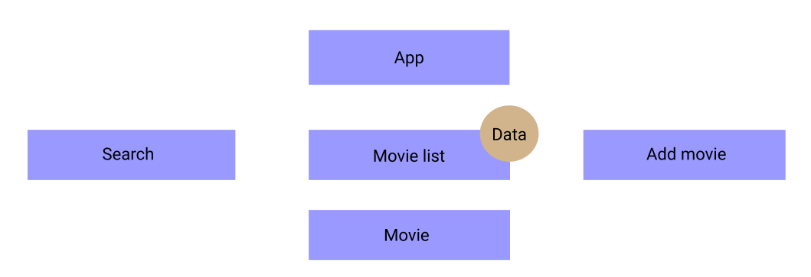
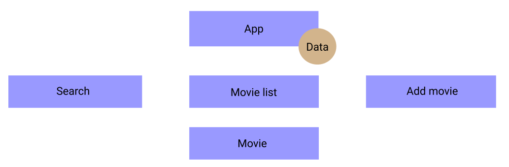
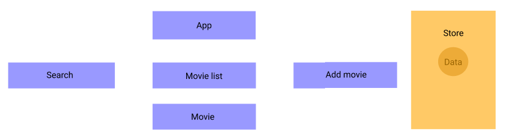

# React Redux

## Basics concept :

- A pattern for manange and update application state, using event called action. All the state is hold at someplaces called store, with rules ensuring all state updated in a predictable.
- Redux helps managing global state. Help developer know where, when, how, why the state being updated.
- Use in big project with complex logic state.

Why using redux ?

Data from movie list component **passed down** to movie component (data flow). We need to pass the data to search component in order to search the movie we want.



In order to do that, we have to keep the data to the **most parrent** ( App component in this case ) following the data flow rule. In situation that the data is more complex, this causes problems.



Keep a store independent from the application and but the app can access to the data. To do this, in React, there is a method help manage this data flow called Redux.



### Redux data flow


#### Store :

- Contain all global state.

#### Action :

- Dispatch from event handler in view
- Has a type and hold optional data called payload.
- A function that return a plain of object.

```javascript
export function selectData(data){
    type: "SELECT_DATA",
    payload: data,
}
```

#### Reducer :

- Function that receives an action and the previous state and based on its type and payload to handle the logic updating state in the store.
- Not changing the value of state, but update the new state.
- Handle complicated function and logic.

## Redux with async event

Handle async event such as complicated computed state required time, API call, ...

We can do this using third-party library called middleware. There some middle that React using : Redux Thunk, Redux Saga


### Redux Thunk

- Thunk function is function that returned from action function which handle the asynchronous actions and return the synchronus actions to reducer.

An example of thunk action

```javascript
export function getData(query) {
  return async (dispatch) => {
    const response = await getDataApi(query);
    dispatch({
      type: "GET_DATA",
      payload: response,
    });
  };
}
```

### Redux Saga

- Using generator function `function* funcName()` to handle the async event.
- Has a Worker and a Watcher to handle the event. The worker will handle the async action. And the watcher will watch the action dispatched and fork the worker matched the pattern.

- **put** instead of **dispatch**

```javascript
// worker
export function* getData(action) {
  try {
    const response = yield call(getDataApi, action.payload);
    yield put({ type: SUCCESS, payload: response.data });
  } catch (e) {
    yield put({ type: FAILURE, payload: e });
  }
}

watcher;
export function* Data() {
  yield takeLatest(REQUEST, getData);
}
```

- **yield** command is an effect blocking or non-blocking. If it's a promise, it will block until the promise is done.
- **takeLatest** : `yield takeLatest(pattern, saga)` fork a saga on each specific action dispatched that match the pattern. And automatically cancel previous saga if they are still running. Return the latest action if many actions consecutively triggered.
