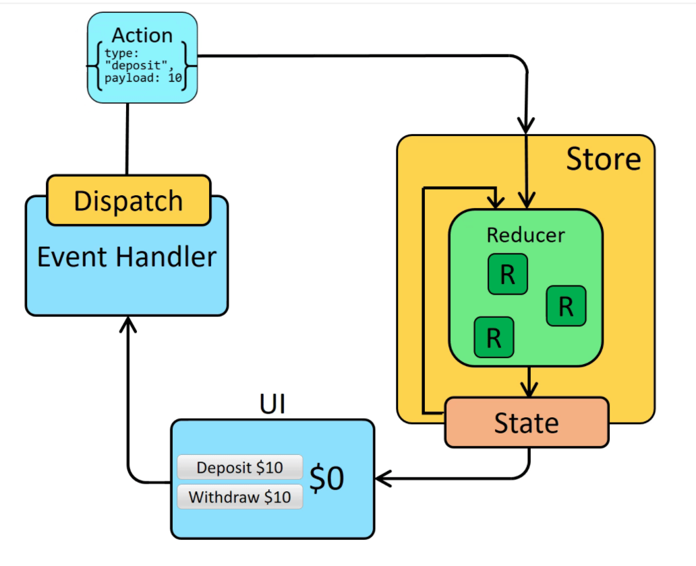

# React Redux

## Basics concept :
- A pattern for manange and update application state, using event called action. All the state is hold at someplaces called store, with rules ensuring all state updated in a predictable.
- Redux helps managing global state. Help developer know where, when, how, why the state being updated.
- Use in big project with complex logic state.

### Redux data flow 


#### Store :
- Contain all global state.
#### Action :
- Dispatch from event handler in view
- Have a type and hold optional data called payload.
- A function that return a plain of object.

```javascript
export function selectData(data){
    type: "SELECT_DATA",
    payload: data,
}
```
#### Reducer :
- Function that receives an action and the previous state and based on its type and payload to handle the logic updating state in the store.
- Not changing the value of state, but update the new state.
- Handle complicated function and logic.
## Redux with async event
Handle async event such as complicated computed state required time, API call, ...


### Redux Thunk
- Thunk function is function that returned from action function which handle the asynchronous actions and return the synchronus actions to reducer.

An example of thunk action
```javascript
export function getData(query){
    return async dispatch => {
        const response = await getDataApi(query)
        dispatch ({
            type: "GET_DATA",
            payload: response,
        })
    }
};
```

### Redux Saga

- Using generatỏ function ```function* funcName()``` to handle the async event.
- Has a Worker and a Watcher to handle the event.
- **put** instead of **dispatch**

```javascript

export function* getData(action){
    try{
        const response = yield call(getDataApi, action.payload);
        yield put({type: SUCCESS, payload : response.data})
    }catch(e){
        yield put({type: FAILURE, payload : e})
    }
}

export function *Data(){
    yield takeLatest((REQUEST), getData);
}   
```