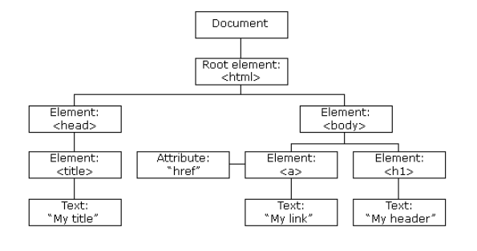

## Rendering in React 
### DOM ( Document Object Model )
DOM is a structured representation of HTML element that are presented in a webpage or web-app. DOM represent the entire UI of the application. For example :



Each UI element is a node in DOM tree. DOM is useful  helping developer modify specified content and update through method : getElementById(), getElementByClass(). 

### Virtual DOM
When DOM changed, browser has to re-render the the webpage and it's time costly.

For example : when submit event, in JQuery :
- Access all related node
- Update if necessary

==> Time cosly ==> Solution : Reactjs using Virtual DOM

Virtual is a exactly like DOM but can't interact with the UI. Working with React is working with object in Virtual DOM not with the DOM. Reactjs handles low-level HTML DOM API to update the DOM :

- React takes a Snapshot of Virtual DOM ( state draft ) and compare with the last updated Virtual DOM then update it.
- After updating, React using Diffing to compare to determine where the changes occured on real DOM then update exactly elements.

## COMPONENT
Component is like JavaScript function. They can have input ( props ) and return React element describe what appear on the sceen.

```JavaScript
function Greeting(props){
    return <h1> Hello, props.name </h1>;
}
```
Using ES6 class
```JavaScript
class Greeting extends React.component{
    render(){
        return <h1> Hello, props.name </h1>
    }
}
```
### Props ( properties )

Pure function is function that doesn't change its input.

```JavaScript
function(a,b){
    return a+b; // input a, b not changed
    // return a = a + b ==> impure function
}
```
All function component must be pure. Meaning the props is read-only and cannot be changed.
### Functional Component ( Stateless component )

Functional Component only takes props ( or not ) and renders exactly the component its returned. It can't be changed until the whole web-app reloaded. Meaning it doesn't hold state ( stateless ).

### Class Component ( Stateful component )

Class Component is like function but the difference is class component can hold state. When the state changed, the UI will be updated with the new state ( stateful ).

Because of having state, Class component also has a life cycle.

 For example : clock component

 ```javascript
 class Clock extends React.Component {
  constructor(props) {
    super(props);
    this.state = { date: new Date() };
  }

  componentDidMount() {
    this.timerID = setInterval(() => this.tick(), 1000);
  }

  componentWillUnmount() {
    clearInterval(this.timerID);
  }
  tick() {
    this.setState({ date: new Date() });
  }

  render() {
    return (
      <div>
        <h1>Hello</h1>
        <h2>It is {this.state.date.toLocaleTimeString()}. </h2>
      </div>
    );
  }
}

export default Clock;

```

#### Lifecycle method

With the clock ticking every second, the UI has to update its own state. A method called ``` setState ``` could handle the change. We need a lifecycle for that component to tell what it will change in its life.

- ComponentDidMount() : run after the component rendered the first time.
- ComponentDidUpdate() : run when the state of the component is changed and triggers rerendering.
- ComponentWillUnmount : get the state out of the DOM.


